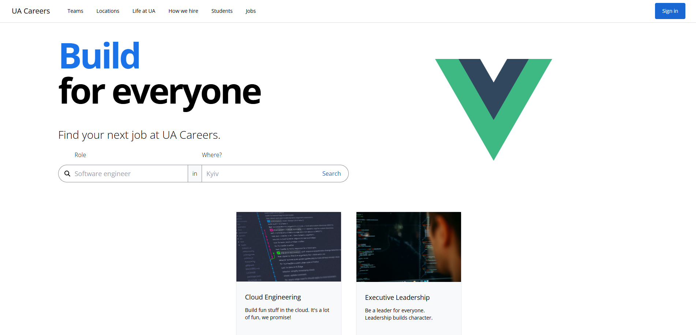
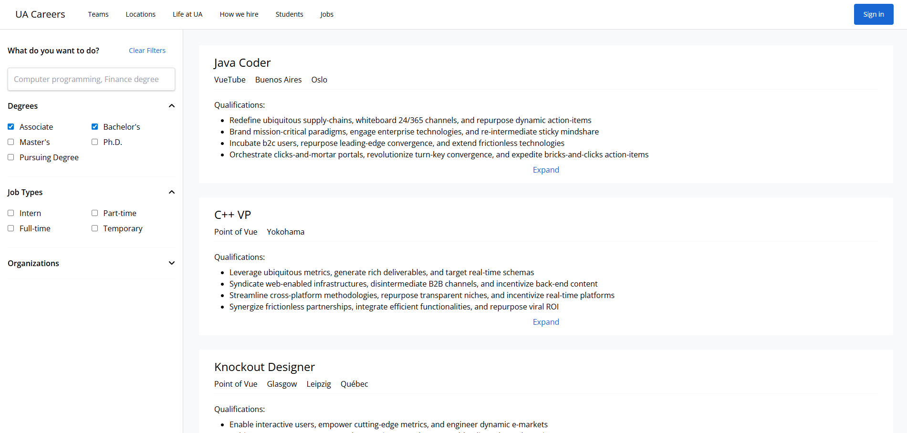
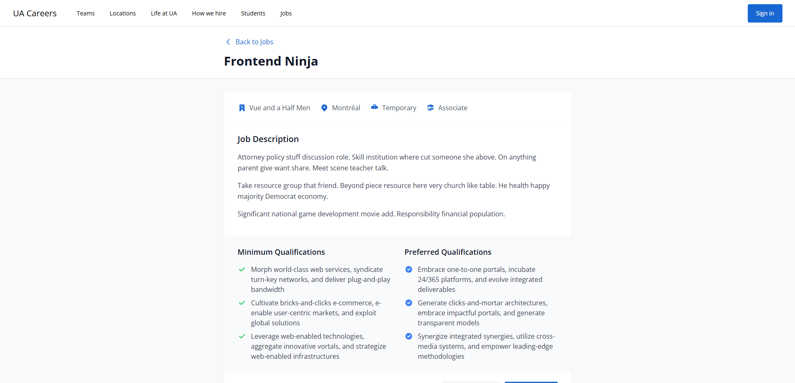

# UA Careers - Vue Jobs Portal

A modern job search platform built with Vue 3, featuring job listings, filtering, and company information pages.

## 📸 Screenshots

### Homepage



### Job Search Results



### Job Details



## 🚀 Technologies Used

- **Vue 3** - Progressive JavaScript framework with Composition API
- **TypeScript** - Type-safe JavaScript development
- **Vite** - Fast build tool and development server
- **Vue Router** - Client-side routing
- **Pinia** - State management for Vue 3
- **Tailwind CSS** - Utility-first CSS framework
- **Axios** - HTTP client for API requests
- **Font Awesome** - Icon library
- **JSON Server** - Mock REST API for development

## 🧪 Testing & Quality

- **Vitest** - Fast unit testing framework
- **Vue Testing Library** - Vue component testing utilities
- **ESLint** - Code linting and style enforcement
- **Prettier** - Code formatting

## 📋 Features

- ✅ Job search and filtering
- ✅ Responsive design
- ✅ Error handling and loading states
- ✅ Company information pages
- ✅ Student and graduate programs
- ✅ Location-based search
- ✅ Pagination for job listings

## 🛠️ Setup

```sh
npm install
```

## 🏃‍♂️ Development

Start the frontend:

```sh
npm run dev
```

Start the mock backend (in a separate terminal):

```sh
npm run backend
```

## 🏗️ Build

```sh
npm run build
```

## 🧪 Testing

```sh
npm run test:unit
```

## 🧹 Linting

```sh
npm run lint
```

## 📁 Project Structure

```
src/
├── api/           # API calls and types
├── components/    # Vue components
├── composables/   # Vue composition functions
├── router/        # Vue Router configuration
├── stores/        # Pinia stores
├── utils/         # Utility functions
├── views/         # Page components
└── main.ts        # App entry point
```
